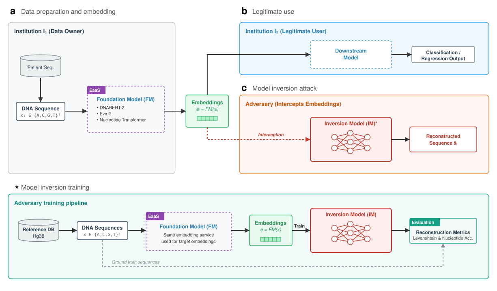

# How Private Are DNA Embeddings?

This repository contains the reproducible benchmark pipeline for studying
sequence reconstruction and individual re-identification from DNA foundation
model embeddings. The current pipeline evaluates mean-pooled representations
from DNABERT-2, Evo 2, and Nucleotide Transformer v2 (NTv2).

> **Results status:** benchmark jobs for the sequence-disjoint revision are
> still running. Numerical results, generated plots, and checkpoints are
> intentionally omitted from this revision so that obsolete results are not
> presented as current. All result directories are ignored by Git.

## Benchmark design

The release benchmark:

1. constructs a coordinate- and sequence-disjoint hg38 corpus across sequence
   lengths 10–100 bp;
2. extracts mean-pooled embeddings from each foundation model;
3. trains one multi-length Query Decoder per foundation model;
4. evaluates reconstruction on held-out hg38 and real-individual 1000 Genomes
   sequences; and
5. evaluates cohort re-identification, including a locus-blind BWA-MEM attack.

The hg38 source corpus contains globally non-overlapping genomic intervals.
Within each sequence length, exact sequence content is unique across the
training, validation, and test splits. This prevents performance estimates from
being inflated by coordinate or exact-sequence reuse.



## Repository layout

- `train.py` and `evaluate.py`: Hydra entry points for model training and
  reconstruction/identification evaluation.
- `generate/`: embedding generators for DNABERT-2, Evo 2, and NTv2.
- `src/`: datasets, models, training, evaluation, plotting, and resumable HDF5
  generation utilities.
- `conf/`: Hydra configurations for datasets, models, generation, training,
  and evaluation.
- `scripts/prepare_hg38_multilen.py`: builds the sequence-disjoint hg38 source
  corpus.
- `scripts/prepare_1000g_multilen.py`: constructs the real-individual 1000
  Genomes out-of-distribution test corpus.
- `scripts/prepare_identification.py`: constructs per-individual
  identification cohorts.
- `run_experiments_multilen.sh`: end-to-end benchmark runner.

## Requirements

The full benchmark requires:

- Python 3.11;
- a CUDA-capable PyTorch environment for embedding extraction and training;
- `samtools` for the hg38 FASTA index;
- `bcftools` for phased 1000 Genomes variants;
- `bwa` for locus-blind identification;
- an hg38 FASTA at `data/hg38.fa`; and
- phased, indexed per-chromosome 1000 Genomes VCFs under
  `data/1000g_vcfs/`.

Install the Python dependencies:

```bash
conda create -n dna-inversion -y python=3.11
conda activate dna-inversion
pip install -r requirements.txt
```

The foundation-model generators may additionally require their model-specific
packages and access to the corresponding checkpoints.

Prepare the reference indices:

```bash
samtools faidx data/hg38.fa
bash scripts/build_bwa_index.sh
```

Large source data, embeddings, checkpoints, logs, and generated results are not
versioned in this repository.

## Run the complete benchmark

The complete pipeline is:

```bash
bash run_experiments_multilen.sh
```

It creates the sequence-disjoint hg38 corpus when absent, generates resumable
embeddings, prepares the 1000 Genomes reconstruction and identification data,
trains one Query Decoder per foundation model, evaluates all tasks, and creates
cross-model comparison plots.

The main resource controls can be supplied as environment variables:

```bash
MAX_JOBS=3 NUM_GPUS=3 MULTI_EPOCHS=20 BWA_THREADS=8 \
  bash run_experiments_multilen.sh
```

Embedding generation is resumable at sample level. Re-running a preparation
script continues compatible partial HDF5 files and skips complete files.

## Run individual stages

Build the hg38 source corpus and embeddings:

```bash
python scripts/prepare_hg38_multilen.py
bash prepare_and_generate_multilen.sh
```

Prepare the 1000 Genomes evaluation datasets:

```bash
bash prepare_and_generate_1000g_multilen.sh
bash prepare_and_generate_identification_multilen.sh --full
```

Train a multi-length Query Decoder:

```bash
python train.py -m \
  data=hg38_multilen_seqdisjoint/ntv2_multi_hg38_multilen_seqdisjoint_mean \
  model=query_decoder \
  hydra.sweep.dir=outputs/train_multilen_seqdisjoint_ntv2 \
  hydra.job.chdir=True
```

Evaluate held-out hg38 reconstruction:

```bash
python evaluate.py \
  run_dir=outputs/train_multilen_seqdisjoint_ntv2 \
  identification_only=false \
  identification.enabled=false \
  hydra.run.dir=outputs/eval_multilen_seqdisjoint_ntv2
```

See `conf/evaluate.yaml` and `run_experiments_multilen.sh` for the 1000
Genomes and identification overrides.

## Data format

Embedding files are HDF5 files containing:

- `sequences`: UTF-8 DNA sequences;
- `embeddings`: mean-pooled embedding vectors; and
- attributes describing the embedding dimension, sequence length, ordered
  input hash, input count, and generation-completion state.

The hg38 source corpus stores one group per sequence length under
`/lengths/<L>`, with `sequences`, `chrom`, zero-based `start`, and
deterministic `split` datasets.

## Tests

```bash
pytest -q
```

## Citation

If you use this software, cite:

> Kreuer J, Ouaari S, Pfeifer N. *How Private Are DNA Embeddings? Inverting
> Foundation Model Representations of Genomic Sequences.* 2026.
> https://doi.org/10.48550/arXiv.2603.06950

Machine-readable citation metadata is available in `CITATION.cff`.

## License

This project is licensed under the GNU Lesser General Public License v2.1.
